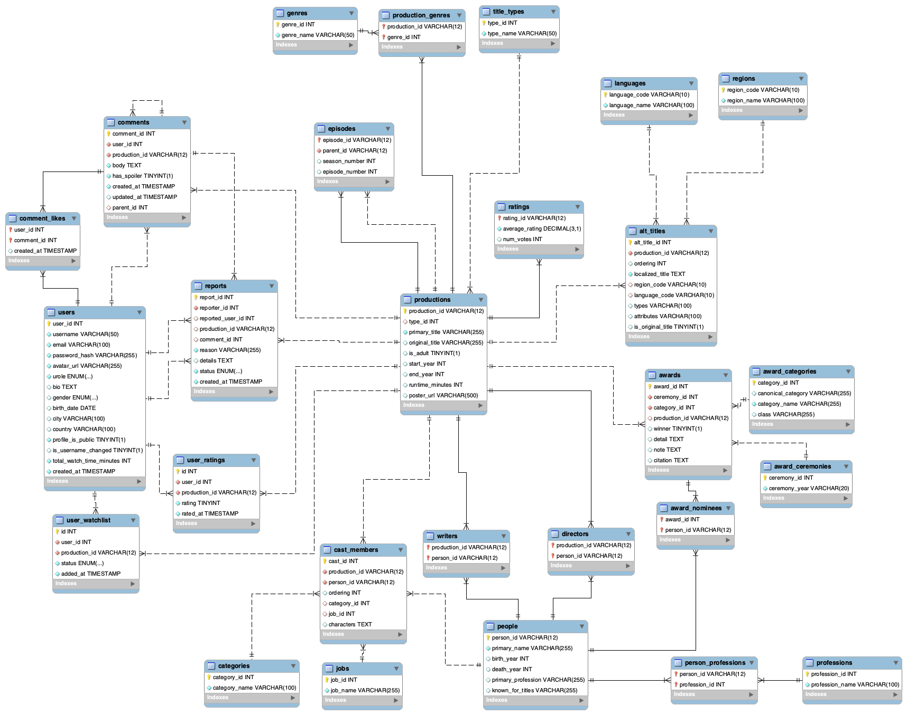

# BLG317

ITU BLG317 – Database Term Project

## Environment Setup

The backend uses a `.env` file located at `backend/.env` for database configuration.  
Update the existing `backend/.env` file to match your local MySQL setup, for example:

```env
DB_HOST=127.0.0.1
DB_NAME=bytesizedDB_project
DB_USER=root
DB_PASS=YourPasswordHere
```

These values are read by the backend using python-dotenv.

## Makefile Commands

This project provides a `Makefile` to simplify local development.
From the project root (`BLG317/`), you can use:

### Create database tables (schema)

```make init-db```

### Insert seed data
```make seed```

### Run both: create schema + seed data
```make db-setup```

### Start the backend server
```make run```

make run will start the Flask backend on:
http://127.0.0.1:5000

After starting the backend, you can open the frontend (e.g. via Live Server)
on:
http://127.0.0.1:5500

## Database Schema


